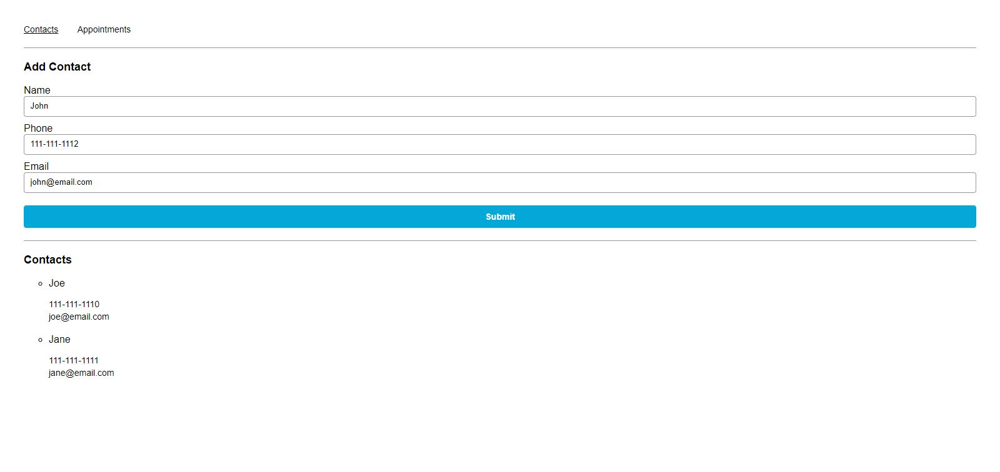
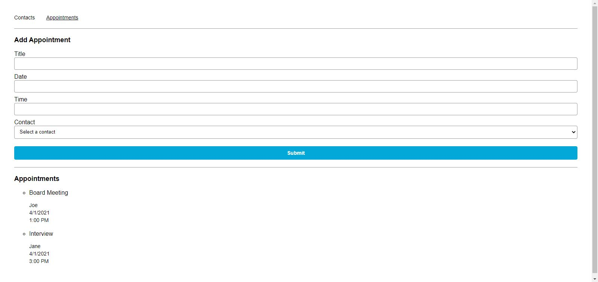

# Appointment Planner

Appointment Planner is one of Codecademy's open-ended projects, in which it is encouraged to problem solve and utilize other resources, instead of being provided with step-by-step guidance. The requirements were to utilize functional React components and hooks to create an app that manages contacts and appointments. The app's external structure was pre-configured and consisted of two pages: one to view and add contacts and one to view and add appointments. We were assigned the tasks of implementing the state, functionality and interactivity of the functional React components.

## Table of Contents

- [Technologies](#technologies)
- [Screenshots](#screenshots)
- [Status](#status)

## Technologies

This project was created with:

- JavaScript ES6
- Node.js version: 14.15.1
- React version: 17.0.1
- React Router version: 5.2.0

## Screenshots

## Status

This project has been completed.